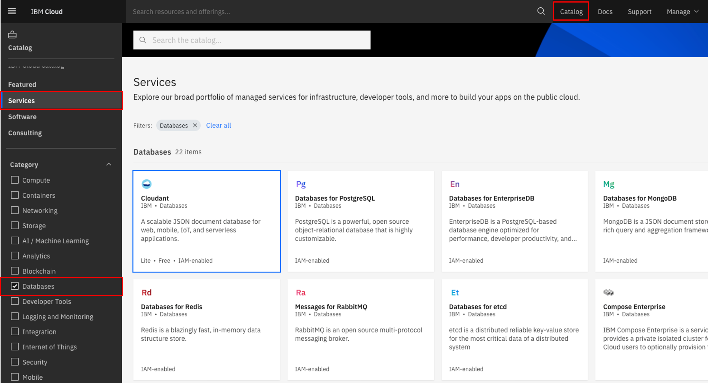
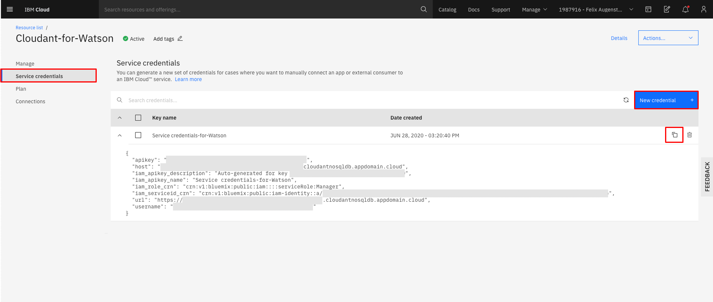

<h1 align="center" style="border-bottom: none;">:rocket: IBM Digital Tech Tutorial: Webhooks Part II</h1>
<h3 align="center">In this hands-on tutorial you will create demo for Watson Assistant that is able to create a ticket if you have any problems. This ticket is then saved to a Cloudant database and you can verify the ticket status.</h3>

## Prerequisites

1. Sign up for an [IBM Cloud account](https://cloud.ibm.com/registration).
2. Fill in the required information and press the „Create Account“ button.
3. After you submit your registration, you will receive an e-mail from the IBM Cloud team with details about your account. In this e-mail, you will need to click the link provided to confirm your registration.
4. Now you should be able to login to your new IBM Cloud account ;-)

## Digital Tech Tutorial Watson Assistant Webhooks Part I and II

This tutorial consists of 2 parts, you can start with part I or II. 
[Part I - Watson sends a reminder via e-mail](https://github.com/FelixAugenstein/digital-tech-tutorial-watson-assistant-webhooks) 
[Part II - Watson creates a ticket and saves it to a Cloudant database](https://github.com/FelixAugenstein/digital-tech-tutorial-watson-assistant-webhooks-part-ii/)

## Set up the Cloudant DB

After the login you will see your IBM Cloud Dashboard. Go to Catalog and select the Databases category under services or search for Cloudant. Then create a new Cloudant, the Lite Plan should work for this tutorial. As Authentication method choose IAM.

In your IBM Cloud Account go to the dashboard by clicking the IBM Logo in the upper left. Click on your new Cloudant service and select Service credentials to create new credentials. Copy them by clicking the copy button.

## If you have any questions just contact me
Felix Augenstein 
Digital Tech Ecosystem & Developer Representative @IBM 
Twitter: [@F_Augenstein](https://twitter.com/F_Augenstein) 
LinkedIn: [linkedin.com/in/felixaugenstein](https://www.linkedin.com/in/felixaugenstein/)
